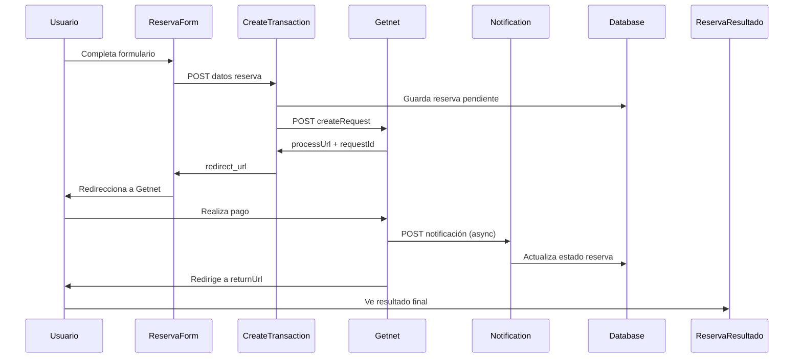

# Integración Getnet Web Checkout v2.3

Esta documentación describe la implementación completa de Getnet Web Checkout en el sistema de reservas de cabañas.

## Configuración

### Variables de entorno requeridas

Copiar `.env.example` y configurar:

```bash
# Ambiente de pruebas (incluido en documentación)
GETNET_LOGIN=7ffbb7bf1f7361b1200b2e8d74e1d76f
GETNET_SECRET_KEY=SnZP3D63n3I9dH9O
GETNET_BASE_URL=https://checkout.test.getnet.cl

# URL del sitio (requerida para callbacks)
SITE_URL=http://localhost:4321
```

### Pasos para producción

1. Integrar en ambiente de pruebas ✅
2. Enviar Formulario de Validación a `integracionweb@getnet.cl`
3. Esperar credenciales de producción (2 días hábiles)
4. Actualizar variables de entorno:
   ```bash
   GETNET_BASE_URL=https://checkout.getnet.cl
   GETNET_LOGIN=tu_login_produccion
   GETNET_SECRET_KEY=tu_secret_produccion
   ```

## Endpoints implementados

### 1. Crear transacción

- **Endpoint**: `POST /api/payment/create-transaction`
- **Función**: Crea una sesión de pago con Getnet
- **Respuesta**: URL de redirección al Web Checkout

**Datos requeridos**:

```json
{
  "nombre": "Juan Pérez",
  "email": "juan@example.com",
  "telefono": "912345678",
  "documento": "12345678-9", // Opcional
  "cabaña_id": "123",
  "fecha_inicio": "2024-01-01",
  "fecha_fin": "2024-01-03",
  "monto": 50000
}
```

### 2. Consultar estado

- **Endpoint**: `POST /api/payment/get-request-info`
- **Función**: Consulta el estado de una transacción
- **Uso**: Para verificar el pago cuando el usuario retorna

**Datos requeridos**:

```json
{
  "requestId": "12345"
}
```

### 3. Notificaciones (Webhook)

- **Endpoint**: `POST /api/payment/notification`
- **Función**: Recibe notificaciones asíncronas de Getnet
- **Configuración**: URL debe ser proporcionada a Getnet

**Estados manejados**:

- `APPROVED` → Reserva confirmada
- `DECLINED/REJECTED/FAILED` → Reserva fallida
- `PENDING` → En proceso
- `REFUNDED` → Reembolsada

### 4. Reversar pago

- **Endpoint**: `POST /api/payment/reverse`
- **Función**: Reversa un pago (solo el mismo día)
- **Limitación**: Hasta las 23:59 del día de la transacción

### 5. Respuesta de pago

- **Endpoint**: `GET/POST /api/payment/response`
- **Función**: Maneja el retorno del usuario desde Getnet
- **Redirección**: A página de resultado final

## Flujo de pago



## Componentes actualizados

### ReservaForm.jsx

- Campo RUT opcional agregado
- Logo y textos de Getnet según documentación
- Integración con endpoint `create-transaction`
- Manejo de estados de carga

### ReservaResultado.jsx

- Manejo de estados: confirmada, pendiente, fallida
- Visualización de detalles de pago
- Links para reintento en caso de error

## Estados de reserva

| Estado        | Descripción                     | Origen                            |
| ------------- | ------------------------------- | --------------------------------- |
| `pendiente`   | Reserva creada, pago en proceso | Sistema                           |
| `confirmada`  | Pago aprobado exitosamente      | Getnet `APPROVED`                 |
| `fallida`     | Pago rechazado o fallido        | Getnet `DECLINED/REJECTED/FAILED` |
| `reembolsada` | Pago reembolsado                | Getnet `REFUNDED`                 |
| `reversada`   | Pago reversado (mismo día)      | Admin manual                      |

## Tarjetas de prueba

Para ambiente de testing usar CVV `123` y fecha futura:

| Tipo       | Número              | Resultado  |
| ---------- | ------------------- | ---------- |
| Visa       | 4111 1111 1111 1111 | Aprobación |
| Visa       | 4110 7600 0000 0008 | Aprobación |
| Visa       | 4110 7600 0000 0065 | Rechazo    |
| MasterCard | 5367 6800 0000 0013 | Rechazo    |

## Seguridad

- Autenticación con SHA-256 y Base64
- Validación de firma en notificaciones
- TLS 1.2+ requerido
- Credenciales nunca expuestas al cliente

## Monitoreo

- Logs detallados en todos los endpoints
- Debug endpoint: `/api/payment/debug`
- Verificación de configuración

## Consideraciones importantes

1. **Tiempos**: Sesiones expiran en 15 minutos
2. **Reversas**: Solo mismo día hasta 23:59
3. **Notificaciones**: Solo en estados finales
4. **Referencias**: Deben ser únicas por transacción
5. **Monedas**: Solo CLP soportado

## Troubleshooting

### Error común: Autenticación fallida

- Verificar credenciales en variables de entorno
- Comprobar formato de fecha (ISO 8601)
- Validar que el servidor use TLS 1.2+

### Error: Notificación no auténtica

- Verificar URL de notificación configurada en Getnet
- Comprobar que la firma SHA-1 se calcule correctamente
- Validar que `GETNET_SECRET_KEY` esté configurado

### Error: Transacción no encontrada

- Verificar que `requestId` se guarde correctamente en BD
- Comprobar que la consulta use el ID como string
- Validar estado de la reserva en la base de datos
